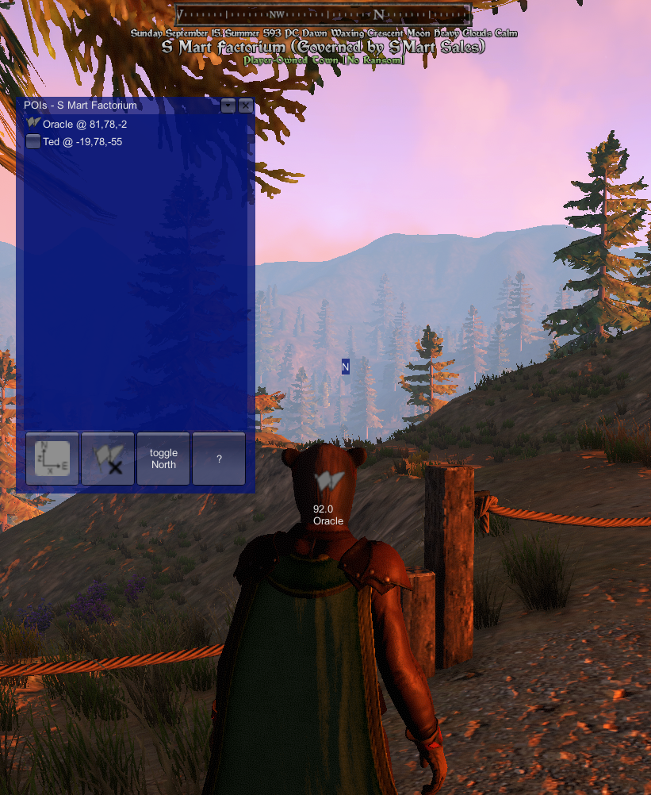

# crashcodes.poi



Add-on for [Shroud of the Avatar](https://www.shroudoftheavatar.com/) to manage points of interest.

This add-on is very similar to [SotA-Lua-Waypoints](https://github.com/John-Markus/SotA-Lua-Waypoints) which I wish I would have found earlier!


## Installation

Use [shroudmod's modmanager](https://shroudmods.com/index.php?modmanager).

or

1. [Download](https://github.com/CrashCodes/sota-add-on-poi/releases) the latest zip.

2. Extract the contents into the [Shroud of the Avatar](https://www.shroudoftheavatar.com/)'s Lua directory. (i.e. `%APPDATA%\Portalarium\Shroud of the Avatar\Lua`)

3. type `/lua reload` within  [Shroud of the Avatar](https://www.shroudoftheavatar.com/).


On Windows for example, you should end directory that looks something like: 
```
%APPDATA%\Portalarium\Shroud of the Avatar\Lua
<DIR>   crashcodes.poi
        crashcodes.poi.lua
```

### To find the the Shroud of the Avatar Lua directory
Within [Shroud of the Avatar](https://www.shroudoftheavatar.com/) type `/datafolder` 
in the chat window. In Windows this will open a File Explorer to the datafolder directory which should contain a Lua subfolder.


## Usage
On loading, a list and explanation of commands will appear in the chat window. 
Also, a POIs window with some buttons will appear. 


The POIs window will show the current Scene Name, a list of pois for this scene, and some buttons. 

### List of pois
Clicking on the button next to a poi in the list will make the corresponding poi active which  will reveal the POI Indicator. The POI Indicator will show you the distance to the POI as well as the direction.

### The two buttons in the upper right of the window
(from left to right)

1. collapses or exapands the window. Hiding or showing the list of pois, while leaving the footer buttons visible.

2. hides the window. The window can be restored by typing `!pois` into Local chat.

### The four footer buttons
(from left to right)

1. toggle inverteted coordinates for this scene. Huh? Some scenes have x and z rise as you travel towards East and North respectively. Other scenes have x and z rise as you travel towards West and South respectively. The image on the button indicates the currently selected coordinate system.

2. mark/clear active poi. If there is not active poi this button will set the player's current location as a temporary poi and make it active. If there is an active poi, this button will make no poi active. 

3. toggle North. Toggles an indicator similar to the POI Indicator, but always points North. (well, unless the coordinate system is not set correctly for the scene)

4. help, this button makes the help text appear in the chat window.


## Working with this Repository
- install [Shroud of the Avatar](https://www.shroudoftheavatar.com/) and create an account
- install [NodeJS](https://nodejs.org) (I'm using version 12.16.3)
- install [git](https://git-scm.com/)
- fork this repository
- git clone the forked repository to a local dev directory
- run `npm install` in the local dev directory
- update `destFolder` in gulpfile.js to match your Shroud of the Avatar Lua path
- run `npm run dev` this will keep the files your local dev directory
- run Shroud of the Avatar
- type `/lua reload` into Shroud of the Avatar after ever edit
- have fun

### Continuous Integration
I had a hard time choosing between [Azure Pipelines](https://azure.microsoft.com/en-us/services/devops/pipelines/) and [Travis CI](https://travis-ci.org/). I ended up going with [Azure Pipelines](https://azure.microsoft.com/en-us/services/devops/pipelines/). 
- [Azure DevOps Project](https://dev.azure.com/crashcodes/sota-add-on-poi)

The build is managed with [azure-pipelines.yml](azure-pipelines.yml), but the release is in the [Azure DevOps Releases](https://dev.azure.com/crashcodes/sota-add-on-poi/_release).


### Useful tools
- [GIMP](https://www.gimp.org/)
- [Visual Studio Code](https://code.visualstudio.com/download)
- [vscode-lua](https://github.com/trixnz/vscode-lua) Visual Studio Code Extension
- [shroudmods.com](https://shroudmods.com/index.php?apireferences)
- [Shroud of the Avatar Forums](https://www.shroudoftheavatar.com/forum/index.php?forums/lua-discussions.2284/)
- [Discord lua-scripting-api](https://discord.com/channels/179618786972925952/643948781410451472)


### Useful in-game slash commands
- `/loc` - current location x,y,z
- `/loctrack` - toggle onscreen x,y,z that is constantly udpated
- `/debug` - toggle debug console that appears as a small bar at the top of the screen which can be expanded. I haven't found how to make it useful yet, but it has gotta be right.


## TODO
- research automating the deploy to [shroudmods.com's mod list](https://shroudmods.com/index.php?modlist)
- add a changelog
- linting
- minification
- research testing
- ignore settings.json in gulp sync task
- load default settings if settings.json is missing
